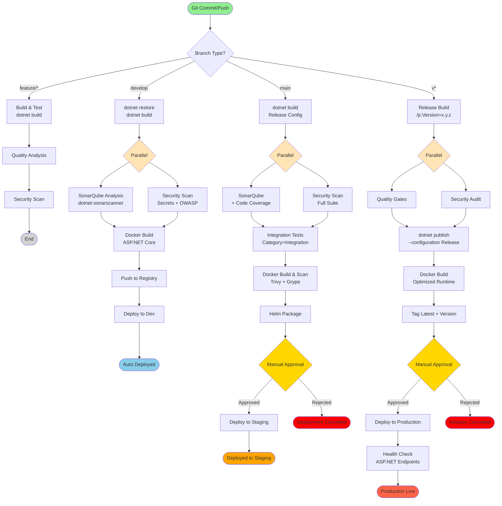

# Production-Ready .NET Pipeline

Battle-tested CI/CD pipeline for .NET projects, based on best practices from **Microsoft**, **Stack Overflow**, and **GitHub**.

## Key Features

✅ **Multi-Target Support** - .NET 6, 7, 8 and .NET Framework
✅ **NuGet Caching** - Faster dependency resolution
✅ **xUnit/NUnit/MSTest** - All major test frameworks
✅ **Code Coverage** - Coverlet with 80% threshold
✅ **SonarQube Integration** - Quality gates and code analysis
✅ **Security Scanning** - OWASP, Trivy, secrets detection
✅ **Docker Multi-stage** - Optimized ASP.NET Core images
✅ **Kubernetes Deployment** - Helm charts with rollback

## Pipeline Flow Diagram



### Pipeline Stages Explained

| Stage | Description | Duration | Failure Impact |
|-------|-------------|----------|----------------|
| **Build & Test** | dotnet build + xUnit/NUnit tests | ~2-4 min | ❌ Pipeline stops |
| **Quality Analysis** | SonarQube + Coverlet coverage (80%) | ~2-3 min | ❌ Pipeline stops |
| **Security Scan** | Secrets, OWASP, NuGet vulnerabilities | ~2-3 min | ⚠️ Warning (develop), ❌ Fail (main/tags) |
| **Integration Tests** | Tests with Category=Integration | ~5-8 min | ❌ Pipeline stops |
| **Docker Build** | Multi-stage ASP.NET Core image | ~3-5 min | ❌ Pipeline stops |
| **Helm Package** | Chart validation and packaging | ~1 min | ❌ Pipeline stops |
| **Deploy to Dev** | Auto-deploy to development | ~2-3 min | ⚠️ Warning only |
| **Deploy to Staging** | Manual approval required | ~3-5 min | ❌ Rollback triggered |
| **Deploy to Production** | Manual approval, health checks | ~10-15 min | ❌ Auto rollback |

### NuGet Cache Benefits

- **First build**: ~6-8 minutes
- **With cache**: ~2-3 minutes (65% faster)
- **Incremental**: ~45-90 seconds

## Required Configuration

### 1. Project File (.csproj)

```xml
<Project Sdk="Microsoft.NET.Sdk.Web">
  <PropertyGroup>
    <TargetFramework>net8.0</TargetFramework>
    <Nullable>enable</Nullable>
    <ImplicitUsings>enable</ImplicitUsings>
    <TreatWarningsAsErrors>true</TreatWarningsAsErrors>
    <GenerateDocumentationFile>true</GenerateDocumentationFile>
  </PropertyGroup>

  <ItemGroup>
    <PackageReference Include="Microsoft.AspNetCore.OpenApi" Version="8.0.0" />
    <PackageReference Include="Swashbuckle.AspNetCore" Version="6.5.0" />
  </ItemGroup>

  <!-- Test coverage -->
  <ItemGroup>
    <PackageReference Include="coverlet.collector" Version="6.0.0">
      <IncludeAssets>runtime; build; native; contentfiles; analyzers; buildtransitive</IncludeAssets>
      <PrivateAssets>all</PrivateAssets>
    </PackageReference>
    <PackageReference Include="coverlet.msbuild" Version="6.0.0">
      <IncludeAssets>runtime; build; native; contentfiles; analyzers; buildtransitive</IncludeAssets>
      <PrivateAssets>all</PrivateAssets>
    </PackageReference>
  </ItemGroup>
</Project>
```

### 2. Test Project (.csproj)

```xml
<Project Sdk="Microsoft.NET.Sdk">
  <PropertyGroup>
    <TargetFramework>net8.0</TargetFramework>
    <IsPackable>false</IsPackable>
    <Nullable>enable</Nullable>
  </PropertyGroup>

  <ItemGroup>
    <PackageReference Include="Microsoft.NET.Test.Sdk" Version="17.8.0" />
    <PackageReference Include="xunit" Version="2.6.2" />
    <PackageReference Include="xunit.runner.visualstudio" Version="2.5.4" />
    <PackageReference Include="Moq" Version="4.20.70" />
    <PackageReference Include="FluentAssertions" Version="6.12.0" />
    <PackageReference Include="coverlet.collector" Version="6.0.0" />
  </ItemGroup>

  <ItemGroup>
    <ProjectReference Include="..\MyApp\MyApp.csproj" />
  </ItemGroup>
</Project>
```

### 3. Dockerfile

```dockerfile
# Build stage
FROM mcr.microsoft.com/dotnet/sdk:8.0 AS build

WORKDIR /src

# Copy solution and project files
COPY *.sln .
COPY src/**/*.csproj ./
RUN for file in $(ls *.csproj); do mkdir -p src/${file%.*}/ && mv $file src/${file%.*}/; done

# Restore dependencies
RUN dotnet restore

# Copy source code
COPY src/ ./src/

# Build application
WORKDIR /src/MyApp
RUN dotnet build --configuration Release --no-restore

# Publish stage
FROM build AS publish
RUN dotnet publish --configuration Release --no-build -o /app/publish

# Runtime stage
FROM mcr.microsoft.com/dotnet/aspnet:8.0 AS runtime

WORKDIR /app

# Create non-root user
RUN useradd -m -u 1001 appuser && chown -R appuser:appuser /app
USER appuser

# Copy published app
COPY --from=publish /app/publish .

EXPOSE 8080

ENV ASPNETCORE_URLS=http://+:8080

ENTRYPOINT ["dotnet", "MyApp.dll"]
```

### 4. SonarQube Configuration

Create **SonarQube.Analysis.xml**:

```xml
<?xml version="1.0" encoding="utf-8" ?>
<SonarQubeAnalysisProperties xmlns:xsi="http://www.w3.org/2001/XMLSchema-instance"
                             xmlns:xsd="http://www.w3.org/2001/XMLSchema"
                             xmlns="http://www.sonarsource.com/msbuild/integration/2015/1">
  <Property Name="sonar.cs.opencover.reportsPaths">**/coverage/coverage.opencover.xml</Property>
  <Property Name="sonar.coverage.exclusions">
    **/*.cshtml,
    **/Migrations/**,
    **/Program.cs,
    **/Startup.cs
  </Property>
  <Property Name="sonar.exclusions">
    **/bin/**,
    **/obj/**,
    **/wwwroot/lib/**
  </Property>
</SonarQubeAnalysisProperties>
```

## Bitbucket Variables

Configure these in **Repository Settings → Pipelines → Repository Variables**:

```bash
# Docker Registry
DOCKER_REGISTRY=docker.io
DOCKER_REPOSITORY=myorg/myapp
DOCKER_USERNAME=your-username
DOCKER_PASSWORD=***         # Mark as secured

# Kubernetes
KUBECONFIG=***              # Base64 encoded, mark as secured

# SonarQube
SONAR_HOST_URL=https://sonarcloud.io
SONAR_TOKEN=***             # Mark as secured
SONAR_PROJECT_KEY=my-project-key
SONAR_ORGANIZATION=my-org

# NuGet (for package publishing)
NUGET_API_KEY=***           # Mark as secured
```

## Testing Best Practices

### xUnit Test Example

```csharp
using Xunit;
using FluentAssertions;
using Moq;

namespace MyApp.Tests
{
    public class UserServiceTests
    {
        [Fact]
        public void GetUser_WithValidId_ReturnsUser()
        {
            // Arrange
            var mockRepo = new Mock<IUserRepository>();
            mockRepo.Setup(r => r.GetById(1))
                   .Returns(new User { Id = 1, Name = "John" });

            var service = new UserService(mockRepo.Object);

            // Act
            var result = service.GetUser(1);

            // Assert
            result.Should().NotBeNull();
            result.Name.Should().Be("John");
        }

        [Theory]
        [InlineData(0)]
        [InlineData(-1)]
        public void GetUser_WithInvalidId_ThrowsException(int invalidId)
        {
            // Arrange
            var service = new UserService(Mock.Of<IUserRepository>());

            // Act & Assert
            Assert.Throws<ArgumentException>(() => service.GetUser(invalidId));
        }
    }
}
```

### Integration Test Example

```csharp
using Xunit;
using Microsoft.AspNetCore.Mvc.Testing;

namespace MyApp.IntegrationTests
{
    [Trait("Category", "Integration")]
    public class ApiTests : IClassFixture<WebApplicationFactory<Program>>
    {
        private readonly WebApplicationFactory<Program> _factory;

        public ApiTests(WebApplicationFactory<Program> factory)
        {
            _factory = factory;
        }

        [Fact]
        public async Task GetUsers_ReturnsSuccessAndCorrectContentType()
        {
            // Arrange
            var client = _factory.CreateClient();

            // Act
            var response = await client.GetAsync("/api/users");

            // Assert
            response.EnsureSuccessStatusCode();
            Assert.Equal("application/json; charset=utf-8",
                response.Content.Headers.ContentType.ToString());
        }
    }
}
```

## Performance Optimization

### NuGet Package Caching

```xml
<!-- In Directory.Build.props -->
<Project>
  <PropertyGroup>
    <RestorePackagesWithLockFile>true</RestorePackagesWithLockFile>
    <DisableImplicitNuGetFallbackFolder>true</DisableImplicitNuGetFallbackFolder>
  </PropertyGroup>
</Project>
```

### Parallel Test Execution

```bash
# Run tests in parallel
dotnet test --configuration Release --parallel
```

### AOT Compilation (.NET 8+)

```xml
<PropertyGroup>
  <PublishAot>true</PublishAot>
  <InvariantGlobalization>true</InvariantGlobalization>
</PropertyGroup>
```

## Common Issues

### Build Failing?

1. **Clear NuGet cache**:
   ```bash
   dotnet nuget locals all --clear
   dotnet restore --no-cache
   ```

2. **Check .NET SDK version**:
   ```bash
   dotnet --version
   ```

3. **Verify global.json**:
   ```json
   {
     "sdk": {
       "version": "8.0.100",
       "rollForward": "latestMinor"
     }
   }
   ```

### Tests Failing?

1. **Run locally first**:
   ```bash
   dotnet test --logger "console;verbosity=detailed"
   ```

2. **Check test results**:
   ```bash
   # Results are in TestResults/
   cat TestResults/*.trx
   ```

3. **Isolate test**:
   ```bash
   dotnet test --filter "FullyQualifiedName~MyApp.Tests.UserServiceTests"
   ```

### Coverage Too Low?

1. **View coverage report**:
   ```bash
   dotnet test /p:CollectCoverage=true /p:CoverletOutputFormat=opencover
   reportgenerator -reports:coverage/coverage.opencover.xml -targetdir:coverage/report
   ```

2. **Exclude files from coverage**:
   ```xml
   <PropertyGroup>
     <CoverletExclude>[MyApp]MyApp.Migrations.*,[MyApp]MyApp.Program</CoverletExclude>
   </PropertyGroup>
   ```

## Multi-Target Frameworks

```xml
<PropertyGroup>
  <TargetFrameworks>net6.0;net7.0;net8.0</TargetFrameworks>
</PropertyGroup>
```

Then build for specific framework:

```bash
dotnet build --framework net8.0
```

## Custom Pipelines

### Performance Testing

```bash
# Trigger from Bitbucket UI: Pipelines → Run pipeline → performance-test
# Uses NBomber or BenchmarkDotNet
```

### NuGet Package Publishing

```bash
# Trigger from Bitbucket UI: Pipelines → Run pipeline → package-nuget
# Creates and publishes NuGet packages
```

## References

- [Microsoft .NET Best Practices](https://docs.microsoft.com/en-us/dotnet/core/deploying/best-practices)
- [Stack Overflow Engineering Guidelines](https://stackoverflow.blog/engineering/)
- [ASP.NET Core Performance Best Practices](https://docs.microsoft.com/en-us/aspnet/core/performance/performance-best-practices)
- [Coverlet Documentation](https://github.com/coverlet-coverage/coverlet)

---

**Based on patterns from Microsoft, Stack Overflow, and GitHub** 🚀
