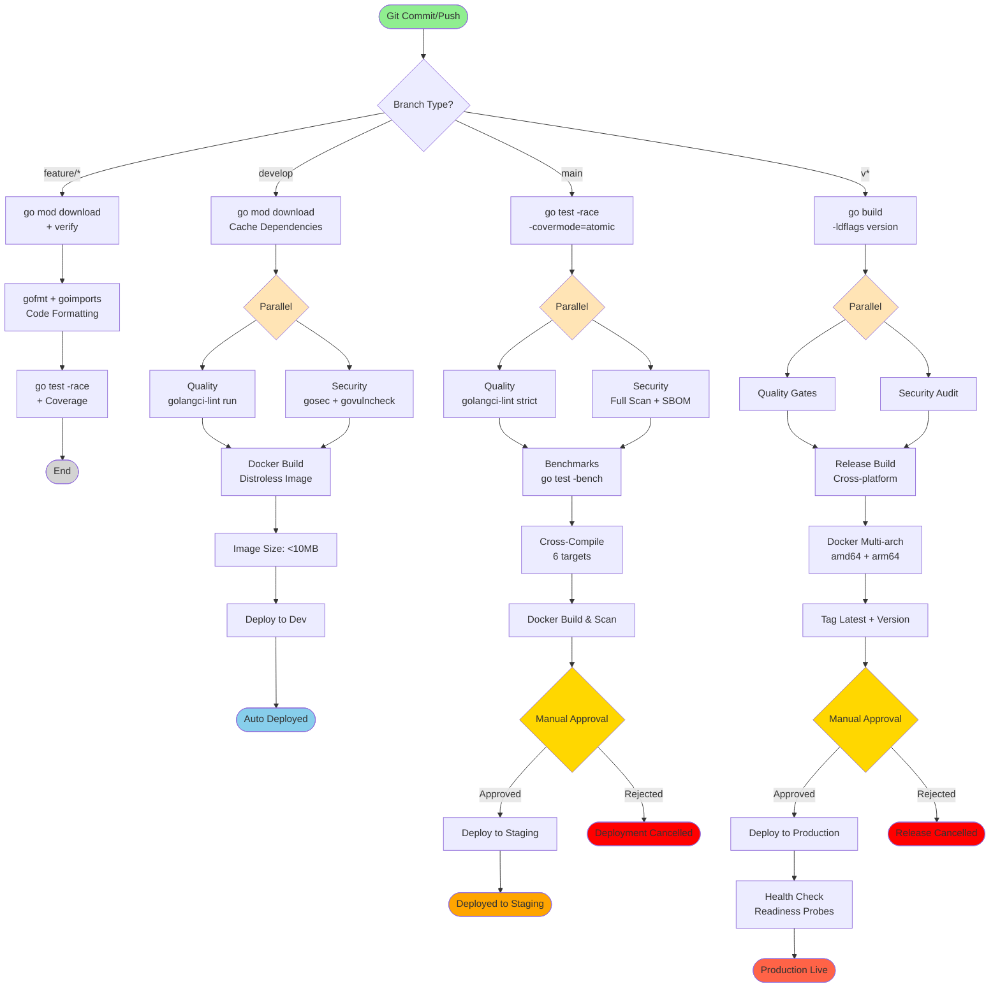

# Production-Ready Go Pipeline

Battle-tested CI/CD pipeline for Go projects, based on best practices from **Google**, **Uber**, and **HashiCorp**.

## Key Features

✅ **Go Modules** - Modern dependency management
✅ **Race Detection** - Concurrent bug detection with `-race`
✅ **Benchmarks** - Performance regression testing
✅ **Code Quality** - golangci-lint with strict rules
✅ **Security Scanning** - gosec, govulncheck, secrets detection
✅ **Cross-Compilation** - Build for multiple OS/arch combinations
✅ **Minimal Docker Images** - Scratch/distroless (<10MB)
✅ **Kubernetes Deployment** - Helm charts with rollback

## Pipeline Flow Diagram



### Pipeline Stages Explained

| Stage | Description | Duration | Failure Impact |
|-------|-------------|----------|----------------|
| **Build & Test** | go test with race detector + coverage | ~2-4 min | ❌ Pipeline stops |
| **Quality Check** | golangci-lint (40+ linters enabled) | ~2-3 min | ❌ Pipeline stops |
| **Security Scan** | gosec + govulncheck + secrets | ~2-3 min | ⚠️ Warning (develop), ❌ Fail (main/tags) |
| **Benchmarks** | go test -bench with comparison | ~3-5 min | ⚠️ Warning on regression |
| **Cross-Compilation** | 6 OS/arch combinations | ~4-6 min | ❌ Pipeline stops |
| **Docker Build** | Scratch/distroless image (<10MB) | ~2-4 min | ❌ Pipeline stops |
| **Deploy to Dev** | Auto-deploy to development | ~2-3 min | ⚠️ Warning only |
| **Deploy to Staging** | Manual approval required | ~3-5 min | ❌ Rollback triggered |
| **Deploy to Production** | Manual approval + health checks | ~10-15 min | ❌ Auto rollback |

### Go Module Cache Benefits

- **First build**: ~5-8 minutes
- **With cache**: ~1-2 minutes (75% faster)
- **Incremental**: ~10-20 seconds

### Cross-Compilation Targets

The pipeline builds for these platforms:

```bash
# Linux
GOOS=linux GOARCH=amd64
GOOS=linux GOARCH=arm64

# macOS
GOOS=darwin GOARCH=amd64
GOOS=darwin GOARCH=arm64

# Windows
GOOS=windows GOARCH=amd64
GOOS=windows GOARCH=arm64
```

### Binary Size Optimization

- **Standard build**: ~10-20MB
- **With ldflags**: ~8-15MB
- **Stripped**: ~6-12MB
- **UPX compressed**: ~2-5MB
- **Scratch container**: **<10MB total**

### Go-Specific Features

- **Race detector**: Finds concurrent bugs
- **Benchmarks**: Tracks performance regressions
- **Coverage**: Atomic mode for accurate reporting
- **Version injection**: Build version into binary
- **Static binaries**: No runtime dependencies

## Quick Start

```bash
# Copy this pipeline to your project
cp examples/golang/bitbucket-pipelines.yml ./

# Initialize Go modules
go mod init github.com/yourorg/yourapp
go mod tidy

# Configure Bitbucket variables
# - DOCKER_USERNAME, DOCKER_PASSWORD
# - KUBECONFIG (for Kubernetes)
```

## Example go.mod

```go
module github.com/yourorg/yourapp

go 1.21

require (
    github.com/gin-gonic/gin v1.9.1
    github.com/stretchr/testify v1.8.4
)
```

## Example .golangci.yml

```yaml
linters:
  enable:
    - errcheck
    - gosimple
    - govet
    - ineffassign
    - staticcheck
    - typecheck
    - unused
    - gofmt
    - goimports
    - misspell
    - gocritic
    - gosec

linters-settings:
  errcheck:
    check-type-assertions: true
  gocritic:
    enabled-tags:
      - diagnostic
      - experimental
      - opinionated
      - performance
      - style
```

## References

- [Google Go Style Guide](https://google.github.io/styleguide/go/)
- [Uber Go Style Guide](https://github.com/uber-go/guide/blob/master/style.md)
- [HashiCorp Engineering](https://www.hashicorp.com/blog/products/terraform)
- [Effective Go](https://go.dev/doc/effective_go)

---

**Based on patterns from Google, Uber, and HashiCorp** 🚀
