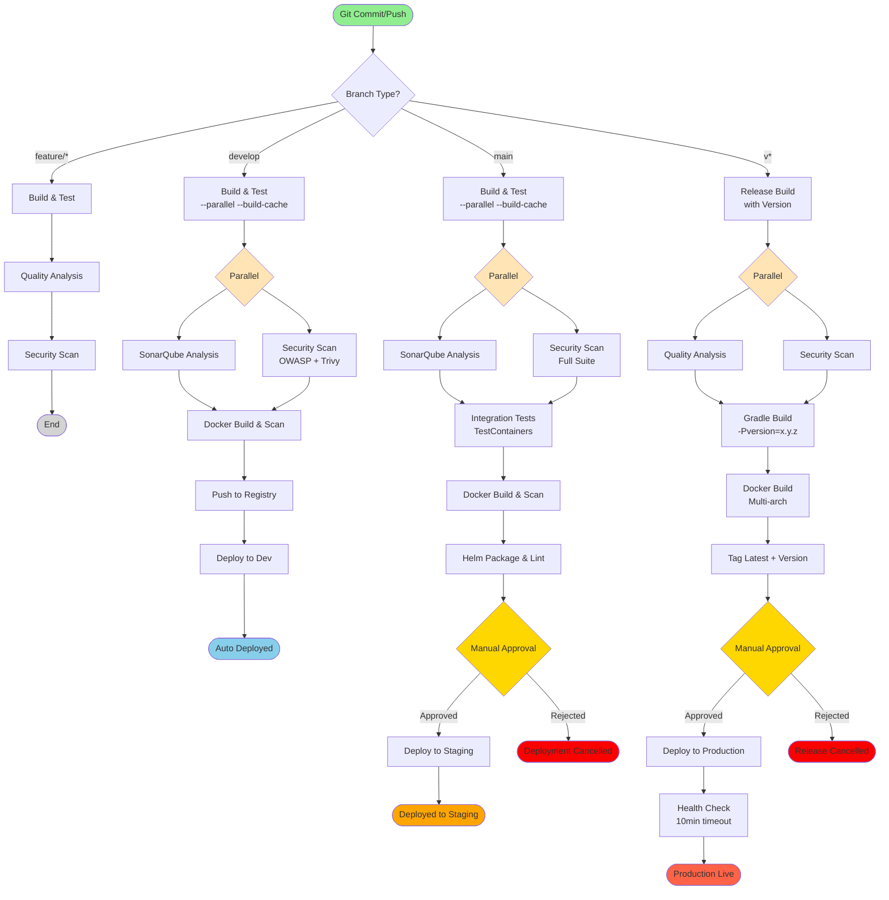

# Production-Ready Java Gradle Pipeline

Battle-tested CI/CD pipeline for Java projects using Gradle, based on best practices from **LinkedIn**, **Netflix**, and **Gradle Inc**.

## Key Features

✅ **Kotlin DSL Support** - Modern Gradle configuration
✅ **Build Cache** - Local and remote caching for 10x faster builds
✅ **Parallel Execution** - Multi-threaded builds and tests
✅ **JaCoCo Coverage** - 80% threshold enforced
✅ **SonarQube Integration** - Quality gates and code smells
✅ **Security Scanning** - OWASP, Trivy, secrets detection
✅ **Docker Multi-stage** - Optimized container images
✅ **Kubernetes Deployment** - Helm charts with rollback

## Pipeline Flow Diagram



### Pipeline Stages Explained

| Stage | Description | Duration | Failure Impact |
|-------|-------------|----------|----------------|
| **Build & Test** | Gradle build with cache, parallel tests | ~2-4 min | ❌ Pipeline stops |
| **Quality Analysis** | SonarQube code quality, JaCoCo coverage | ~2-3 min | ❌ Pipeline stops |
| **Security Scan** | Secrets, OWASP, dependency check | ~2-4 min | ⚠️ Warning (develop), ❌ Fail (main/tags) |
| **Integration Tests** | Gradle integrationTest task | ~5-10 min | ❌ Pipeline stops |
| **Docker Build** | Multi-stage build, layer caching | ~3-5 min | ❌ Pipeline stops |
| **Helm Package** | Chart validation and packaging | ~1 min | ❌ Pipeline stops |
| **Deploy to Dev** | Auto-deploy to development | ~2-3 min | ⚠️ Warning only |
| **Deploy to Staging** | Manual approval required | ~3-5 min | ❌ Rollback triggered |
| **Deploy to Production** | Manual approval, health checks | ~10-15 min | ❌ Auto rollback |

### Build Cache Benefits

- **First build**: ~8-10 minutes
- **With cache**: ~2-3 minutes (75% faster)
- **Incremental**: ~30-60 seconds

## Required Configuration

### 1. build.gradle.kts (Kotlin DSL)

```kotlin
plugins {
    java
    jacoco
    id("org.sonarqube") version "4.4.1.3373"
}

group = "com.example"
version = "1.0.0"

repositories {
    mavenCentral()
}

dependencies {
    implementation("org.springframework.boot:spring-boot-starter-web:3.2.0")
    testImplementation("org.junit.jupiter:junit-jupiter:5.10.1")
    testImplementation("org.springframework.boot:spring-boot-starter-test:3.2.0")
}

java {
    toolchain {
        languageVersion.set(JavaLanguageVersion.of(17))
    }
}

tasks.test {
    useJUnitPlatform()
    maxParallelForks = Runtime.getRuntime().availableProcessors()

    finalizedBy(tasks.jacocoTestReport)
}

tasks.jacocoTestReport {
    reports {
        xml.required.set(true)
        html.required.set(true)
    }

    dependsOn(tasks.test)
}

tasks.jacocoTestCoverageVerification {
    violationRules {
        rule {
            limit {
                minimum = "0.80".toBigDecimal()
            }
        }
    }
}

// Integration tests configuration
sourceSets {
    create("integrationTest") {
        java.srcDir("src/integrationTest/java")
        resources.srcDir("src/integrationTest/resources")
        compileClasspath += sourceSets.main.get().output
        runtimeClasspath += sourceSets.main.get().output
    }
}

val integrationTestImplementation by configurations.getting {
    extendsFrom(configurations.testImplementation.get())
}

tasks.register<Test>("integrationTest") {
    description = "Runs integration tests"
    group = "verification"

    testClassesDirs = sourceSets["integrationTest"].output.classesDirs
    classpath = sourceSets["integrationTest"].runtimeClasspath

    useJUnitPlatform()
    shouldRunAfter(tasks.test)
}

sonarqube {
    properties {
        property("sonar.projectKey", "my-project-key")
        property("sonar.organization", "my-org")
        property("sonar.host.url", "https://sonarcloud.io")
        property("sonar.coverage.jacoco.xmlReportPaths", "build/reports/jacoco/test/jacocoTestReport.xml")
    }
}
```

### 2. gradle.properties

```properties
# Gradle daemon
org.gradle.daemon=true
org.gradle.parallel=true
org.gradle.caching=true
org.gradle.configureondemand=true

# JVM settings
org.gradle.jvmargs=-Xmx2g -XX:MaxMetaspaceSize=512m -XX:+HeapDumpOnOutOfMemoryError

# Build cache
org.gradle.caching.debug=false
```

### 3. Dockerfile

```dockerfile
# Build stage
FROM gradle:8.5-jdk17 AS builder

WORKDIR /app

# Copy Gradle wrapper and build files
COPY gradlew .
COPY gradle gradle
COPY build.gradle.kts settings.gradle.kts ./

# Download dependencies (cached layer)
RUN ./gradlew dependencies --no-daemon

# Copy source code
COPY src src

# Build application
RUN ./gradlew clean build --no-daemon -x test

# Runtime stage
FROM eclipse-temurin:17-jre-alpine

WORKDIR /app

# Create non-root user
RUN addgroup -g 1001 appuser && adduser -D -u 1001 -G appuser appuser

# Copy JAR from build stage
COPY --from=builder /app/build/libs/*.jar app.jar

# Switch to non-root user
USER appuser

EXPOSE 8080

ENTRYPOINT ["java", "-jar", "app.jar"]
```

## Bitbucket Variables

Configure these in **Repository Settings → Pipelines → Repository Variables**:

```bash
# Docker Registry
DOCKER_REGISTRY=docker.io
DOCKER_REPOSITORY=myorg/myapp
DOCKER_USERNAME=your-username
DOCKER_PASSWORD=***         # Mark as secured

# Kubernetes
KUBECONFIG=***              # Base64 encoded, mark as secured

# SonarQube
SONAR_HOST_URL=https://sonarcloud.io
SONAR_TOKEN=***             # Mark as secured
SONAR_PROJECT_KEY=my-project-key
SONAR_ORGANIZATION=my-org
```

## Performance Optimization

### Build Cache

Gradle build cache can speed up builds by 10x:

```kotlin
// Enable in settings.gradle.kts
buildCache {
    local {
        isEnabled = true
        directory = File(rootDir, "build-cache")
        removeUnusedEntriesAfterDays = 30
    }
}
```

### Parallel Execution

```bash
# Enable in gradle.properties
org.gradle.parallel=true
org.gradle.workers.max=4

# Or via CLI
./gradlew build --parallel --max-workers=4
```

### Dependency Resolution

```kotlin
configurations.all {
    resolutionStrategy {
        // Cache dynamic versions for 10 minutes
        cacheDynamicVersionsFor(10, "minutes")

        // Cache changing modules for 4 hours
        cacheChangingModulesFor(4, "hours")
    }
}
```

## Testing Best Practices

### Parallel Test Execution

```kotlin
tasks.test {
    useJUnitPlatform()

    // Parallel execution
    maxParallelForks = Runtime.getRuntime().availableProcessors()

    // Test grouping
    include("**/*Test.class", "**/*Tests.class")

    // Fail fast
    failFast = true
}
```

### Integration Tests

```bash
# Run only unit tests
./gradlew test

# Run only integration tests
./gradlew integrationTest

# Run all tests
./gradlew check
```

## Common Issues

### Build Too Slow?

1. **Enable build cache**:
   ```properties
   org.gradle.caching=true
   ```

2. **Increase heap size**:
   ```properties
   org.gradle.jvmargs=-Xmx4g
   ```

3. **Use parallel execution**:
   ```bash
   ./gradlew build --parallel
   ```

### Tests Failing?

1. **Run locally first**:
   ```bash
   ./gradlew clean test --info
   ```

2. **Check test reports**:
   ```bash
   open build/reports/tests/test/index.html
   ```

3. **Disable parallel tests temporarily**:
   ```kotlin
   tasks.test {
       maxParallelForks = 1
   }
   ```

### Dependency Conflicts?

1. **View dependency tree**:
   ```bash
   ./gradlew dependencies --configuration runtimeClasspath
   ```

2. **Force specific versions**:
   ```kotlin
   configurations.all {
       resolutionStrategy {
           force("com.example:library:1.2.3")
       }
   }
   ```

3. **Exclude transitive dependencies**:
   ```kotlin
   dependencies {
       implementation("com.example:library:1.0.0") {
           exclude(group = "commons-logging", module = "commons-logging")
       }
   }
   ```

## Custom Pipelines

### Performance Testing

```bash
# Trigger from Bitbucket UI: Pipelines → Run pipeline → performance-test
# Uses Gatling for load testing
```

### Dependency Updates

```bash
# Trigger from Bitbucket UI: Pipelines → Run pipeline → dependency-update
# Shows available dependency updates
```

## References

- [Gradle Build Cache](https://docs.gradle.org/current/userguide/build_cache.html)
- [LinkedIn Gradle Plugins](https://github.com/linkedin/gradle-plugins)
- [Netflix Nebula Plugins](https://nebula-plugins.github.io/)
- [Gradle Performance Guide](https://docs.gradle.org/current/userguide/performance.html)

---

**Based on patterns from LinkedIn, Netflix, and Gradle Inc** 🚀
