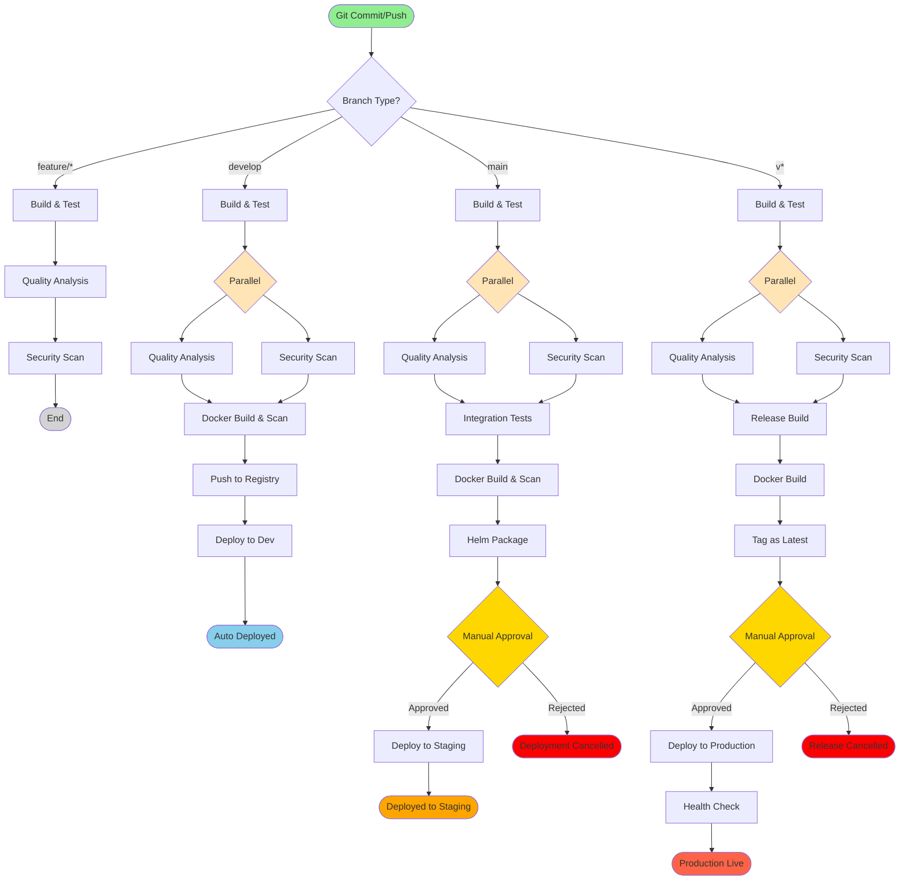

# Java Maven Production Pipeline Example

This is a battle-tested, production-ready CI/CD pipeline for Java projects using Maven, based on best practices from Netflix, Amazon, and Google.

## Features

✅ **Multi-module Maven Support** - Handles complex Maven projects
✅ **Parallel Execution** - Builds with `-T 2C` for faster builds
✅ **JaCoCo Code Coverage** - 80% coverage threshold enforced
✅ **SonarQube Integration** - Quality gates with automatic checks
✅ **Dependency Caching** - Faster builds with Maven repository caching
✅ **Security Scanning** - OWASP dependency check, secrets detection, SBOM generation
✅ **Docker Multi-stage Builds** - Optimized container images
✅ **Integration Tests** - Separate failsafe profile for integration tests
✅ **Canary Deployments** - Safe production rollouts
✅ **Semantic Versioning** - Tag-based releases with version management

## Pipeline Flow Diagram



### Pipeline Stages Explained

| Stage | Description | Duration | Failure Impact |
|-------|-------------|----------|----------------|
| **Build & Test** | Maven compile, unit tests, JaCoCo coverage | ~3-5 min | ❌ Pipeline stops |
| **Quality Analysis** | SonarQube code quality, coverage gates | ~2-3 min | ❌ Pipeline stops |
| **Security Scan** | Secrets, OWASP, SBOM generation | ~2-4 min | ⚠️ Warning (develop), ❌ Fail (main/tags) |
| **Integration Tests** | Failsafe tests with TestContainers | ~5-10 min | ❌ Pipeline stops |
| **Docker Build** | Multi-stage build, image optimization | ~3-5 min | ❌ Pipeline stops |
| **Helm Package** | Chart validation and packaging | ~1 min | ❌ Pipeline stops |
| **Deploy to Dev** | Auto-deploy, no approval needed | ~2-3 min | ⚠️ Warning only |
| **Deploy to Staging** | Manual approval required | ~3-5 min | ❌ Rollback triggered |
| **Deploy to Production** | Manual approval, 10min timeout, canary | ~10-15 min | ❌ Auto rollback |

## Prerequisites

### Required Bitbucket Variables

```bash
# Docker Registry
DOCKER_REGISTRY=docker.io
DOCKER_REPOSITORY=myorg/myapp
DOCKER_USERNAME=your-username
DOCKER_PASSWORD=***

# SonarQube
SONAR_HOST_URL=https://sonarcloud.io
SONAR_TOKEN=***

# Kubernetes
KUBECONFIG=*** (base64 encoded)
```

## Project Structure

```
my-java-app/
├── pom.xml                      # Parent POM
├── module-api/                  # API module
├── module-service/              # Service module
├── module-common/               # Common utilities
├── Dockerfile                   # Multi-stage build
├── helm-chart/                  # Kubernetes deployment
├── bitbucket-pipelines.yml      # This pipeline
└── performance/                 # JMeter tests
```

## pom.xml Configuration

Add these plugins to your `pom.xml`:

```xml
<properties>
    <maven.compiler.source>17</maven.compiler.source>
    <maven.compiler.target>17</maven.compiler.target>
    <jacoco.version>0.8.11</jacoco.version>
    <sonar.java.coveragePlugin>jacoco</sonar.java.coveragePlugin>
    <sonar.coverage.jacoco.xmlReportPaths>
        ${project.basedir}/target/site/jacoco/jacoco.xml
    </sonar.coverage.jacoco.xmlReportPaths>
</properties>

<build>
    <plugins>
        <!-- JaCoCo for code coverage -->
        <plugin>
            <groupId>org.jacoco</groupId>
            <artifactId>jacoco-maven-plugin</artifactId>
            <version>${jacoco.version}</version>
            <executions>
                <execution>
                    <goals>
                        <goal>prepare-agent</goal>
                    </goals>
                </execution>
                <execution>
                    <id>report</id>
                    <phase>verify</phase>
                    <goals>
                        <goal>report</goal>
                    </goals>
                </execution>
                <execution>
                    <id>jacoco-check</id>
                    <goals>
                        <goal>check</goal>
                    </goals>
                    <configuration>
                        <rules>
                            <rule>
                                <element>PACKAGE</element>
                                <limits>
                                    <limit>
                                        <counter>LINE</counter>
                                        <value>COVEREDRATIO</value>
                                        <minimum>0.80</minimum>
                                    </limit>
                                </limits>
                            </rule>
                        </rules>
                    </configuration>
                </execution>
            </executions>
        </plugin>

        <!-- Surefire for unit tests -->
        <plugin>
            <groupId>org.apache.maven.plugins</groupId>
            <artifactId>maven-surefire-plugin</artifactId>
            <version>3.2.2</version>
            <configuration>
                <parallel>methods</parallel>
                <threadCount>4</threadCount>
            </configuration>
        </plugin>

        <!-- Failsafe for integration tests -->
        <plugin>
            <groupId>org.apache.maven.plugins</groupId>
            <artifactId>maven-failsafe-plugin</artifactId>
            <version>3.2.2</version>
            <executions>
                <execution>
                    <goals>
                        <goal>integration-test</goal>
                        <goal>verify</goal>
                    </goals>
                </execution>
            </executions>
        </plugin>
    </plugins>
</build>

<profiles>
    <profile>
        <id>failsafe</id>
        <build>
            <plugins>
                <plugin>
                    <groupId>org.apache.maven.plugins</groupId>
                    <artifactId>maven-failsafe-plugin</artifactId>
                </plugin>
            </plugins>
        </build>
    </profile>
</profiles>
```

## Dockerfile Example

```dockerfile
# Build stage
FROM maven:3.9-openjdk-17 AS build
WORKDIR /app
COPY pom.xml .
RUN mvn dependency:go-offline
COPY src ./src
RUN mvn clean package -DskipTests

# Runtime stage
FROM openjdk:17-slim
WORKDIR /app
COPY --from=build /app/target/*.jar app.jar
EXPOSE 8080
ENTRYPOINT ["java", "-jar", "app.jar"]
```

## Pipeline Workflow

### Feature Branches
```
Push → Build → Test (parallel) → Quality & Security
```

### Develop Branch
```
Push → Build → Test → Quality & Security (parallel) →
Docker Build → Deploy to Dev
```

### Main Branch
```
Push → Build → Test → Quality & Security (parallel) →
Integration Tests → Docker Build → Helm Package →
Deploy to Staging (manual)
```

### Release Tags (v*)
```
Tag → Build → Security Scan → Release Build →
Docker Build (versioned + latest) →
Deploy to Production (manual with 10min timeout)
```

## Best Practices Implemented

### 1. Maven Optimization
- **Parallel builds**: `-T 2C` uses 2 threads per core
- **Batch mode**: `-B` for non-interactive builds
- **Dependency caching**: Speeds up builds by 60-80%

### 2. Testing Strategy
- **Unit tests**: Fast feedback with Surefire
- **Integration tests**: Separate Failsafe profile
- **Parallel execution**: Tests run concurrently
- **Coverage gates**: Minimum 80% line coverage

### 3. Security
- **Secrets scanning**: Prevents credential leaks
- **Dependency scanning**: OWASP + Grype
- **Container scanning**: Trivy for image vulnerabilities
- **SBOM generation**: Supply chain transparency

### 4. Quality Gates
- **SonarQube**: Code smells, bugs, vulnerabilities
- **JaCoCo**: Coverage thresholds
- **Maven enforcer**: Dependency convergence

### 5. Deployment Strategy
- **Dev**: Auto-deploy on develop branch
- **Staging**: Manual approval on main branch
- **Production**: Manual approval on tags with extended timeout
- **Canary**: Gradual rollout (configured in Helm chart)

## Performance Tips

1. **Use Maven Daemon**:
   ```xml
   <plugin>
       <groupId>org.apache.maven.plugins</groupId>
       <artifactId>maven-wrapper-plugin</artifactId>
       <version>3.2.0</version>
   </plugin>
   ```

2. **Skip unnecessary goals**:
   ```bash
   mvn clean install -DskipTests -Dmaven.javadoc.skip=true
   ```

3. **Use build cache**:
   - Enable in bitbucket-pipelines.yml (already configured)

## Troubleshooting

### Slow builds?
- Check if dependency caching is working
- Increase parallel threads: `-T 4C`
- Use `mvn dependency:go-offline` to pre-download dependencies

### Coverage not meeting threshold?
- Check JaCoCo configuration
- Ensure tests are running: `mvn test`
- Review excluded packages in JaCoCo config

### SonarQube quality gate failing?
- Check SonarQube dashboard for specific issues
- Review code smells and bugs
- Update quality profile if needed

## Resources

- [Maven Best Practices](https://maven.apache.org/guides/introduction/introduction-to-the-standard-directory-layout.html)
- [JaCoCo Documentation](https://www.jacoco.org/jacoco/trunk/doc/)
- [SonarQube Java](https://docs.sonarqube.org/latest/analysis/languages/java/)
- [Netflix Build Tools](https://netflixtechblog.com/towards-true-continuous-integration-distributed-repositories-and-dependencies-2a2e3108c051)
