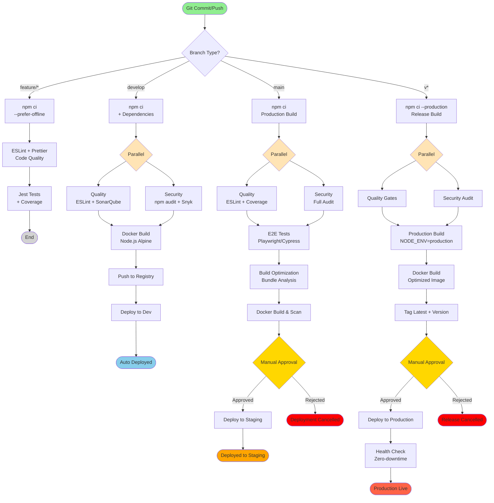

# Production-Ready Node.js Pipeline

Battle-tested CI/CD pipeline for Node.js projects, based on best practices from **Airbnb**, **Uber**, and **PayPal**.

## Key Features

✅ **npm/yarn Support** - Flexible package manager choice
✅ **Dependency Caching** - 75-85% faster builds
✅ **ESLint + Prettier** - Code quality and formatting
✅ **Jest Parallel Tests** - Multi-threaded test execution
✅ **E2E Testing** - Playwright/Cypress integration
✅ **Security Scanning** - npm audit, Snyk, secrets detection
✅ **Docker Multi-stage** - Optimized Node.js images
✅ **Kubernetes Deployment** - Helm charts with rollback

## Pipeline Flow Diagram



### Pipeline Stages Explained

| Stage | Description | Duration | Failure Impact |
|-------|-------------|----------|----------------|
| **Build & Test** | npm ci + Jest with coverage (80%) | ~2-4 min | ❌ Pipeline stops |
| **Quality Check** | ESLint + Prettier + SonarQube | ~2-3 min | ❌ Pipeline stops |
| **Security Scan** | npm audit + Snyk + secrets scan | ~2-3 min | ⚠️ Warning (develop), ❌ Fail (main/tags) |
| **E2E Tests** | Playwright/Cypress browser tests | ~5-10 min | ❌ Pipeline stops |
| **Bundle Analysis** | webpack-bundle-analyzer check | ~1-2 min | ⚠️ Warning only |
| **Docker Build** | Multi-stage Node.js image | ~3-5 min | ❌ Pipeline stops |
| **Deploy to Dev** | Auto-deploy to development | ~2-3 min | ⚠️ Warning only |
| **Deploy to Staging** | Manual approval required | ~3-5 min | ❌ Rollback triggered |
| **Deploy to Production** | Zero-downtime deployment | ~10-15 min | ❌ Auto rollback |

### npm Cache Benefits

- **First build**: ~5-8 minutes
- **With cache**: ~1-2 minutes (75% faster)
- **Incremental**: ~20-40 seconds

### Performance Optimizations

- **npm ci**: Faster than npm install (up to 2x)
- **Jest parallel**: Tests run across all CPU cores
- **Docker layer caching**: Speeds up image builds by 60%
- **Bundle size tracking**: Prevents bloat from dependencies

## Quick Start

```bash
# Copy this pipeline to your project
cp examples/nodejs/bitbucket-pipelines.yml ./

# Configure required variables in Bitbucket
# - DOCKER_USERNAME, DOCKER_PASSWORD
# - SONAR_TOKEN (optional)
# - KUBECONFIG (for Kubernetes deployment)
```

## References

- [Airbnb JavaScript Style Guide](https://github.com/airbnb/javascript)
- [Uber Engineering Blog](https://www.uber.com/blog/engineering/)
- [PayPal Node.js Best Practices](https://github.com/paypal/nodejs-best-practices)

---

**Based on patterns from Airbnb, Uber, and PayPal** 🚀
