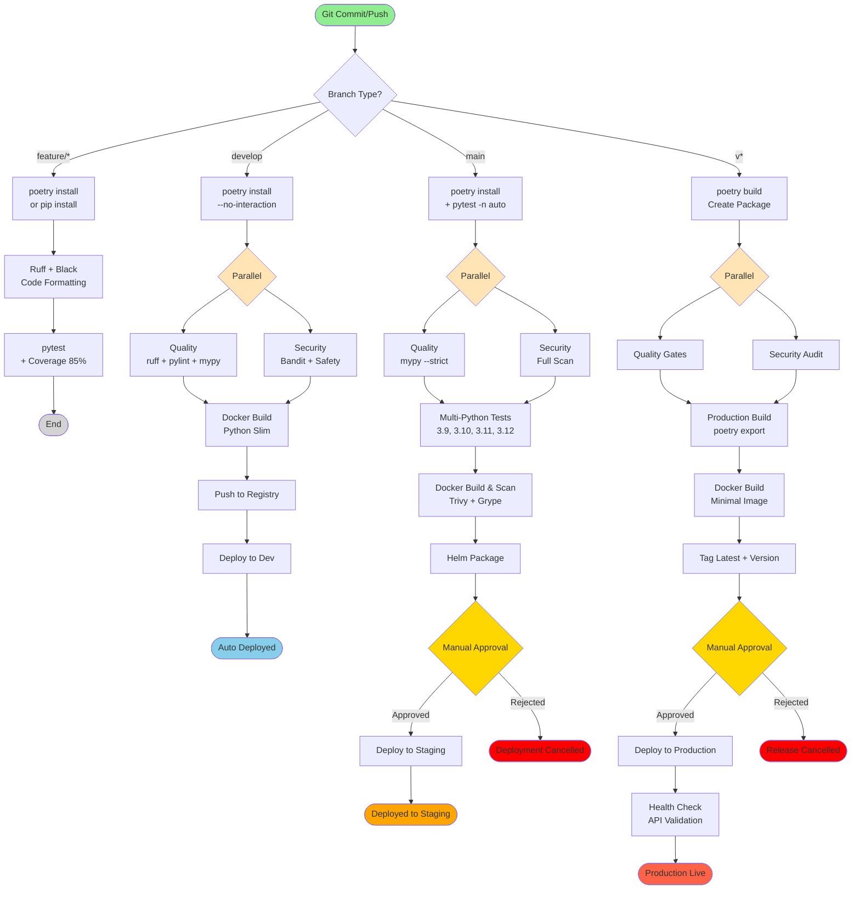

# Production-Ready Python Pipeline

Battle-tested CI/CD pipeline for Python projects, based on best practices from **Instagram**, **Spotify**, and **Dropbox**.

## Key Features

✅ **Poetry/pip Support** - Modern dependency management
✅ **Multi-Python Versions** - Test against 3.9, 3.10, 3.11, 3.12
✅ **pytest Parallel** - Multi-threaded test execution with `-n auto`
✅ **Type Checking** - mypy strict mode enforcement
✅ **Code Quality** - ruff, pylint, black auto-formatting
✅ **Security Scanning** - Bandit, Safety, secrets detection
✅ **Docker Multi-stage** - Optimized Python images
✅ **Kubernetes Deployment** - Helm charts with rollback

## Pipeline Flow Diagram



### Pipeline Stages Explained

| Stage | Description | Duration | Failure Impact |
|-------|-------------|----------|----------------|
| **Build & Test** | Poetry install + pytest (85% coverage) | ~2-4 min | ❌ Pipeline stops |
| **Quality Check** | ruff + pylint + mypy --strict | ~2-3 min | ❌ Pipeline stops |
| **Security Scan** | Bandit + Safety + secrets scan | ~2-3 min | ⚠️ Warning (develop), ❌ Fail (main/tags) |
| **Multi-Python Tests** | Test against 4 Python versions | ~8-15 min | ❌ Pipeline stops |
| **Docker Build** | Multi-stage Python slim image | ~3-5 min | ❌ Pipeline stops |
| **Helm Package** | Chart validation and packaging | ~1 min | ❌ Pipeline stops |
| **Deploy to Dev** | Auto-deploy to development | ~2-3 min | ⚠️ Warning only |
| **Deploy to Staging** | Manual approval required | ~3-5 min | ❌ Rollback triggered |
| **Deploy to Production** | Manual approval + health checks | ~10-15 min | ❌ Auto rollback |

### Poetry Cache Benefits

- **First build**: ~6-10 minutes
- **With cache**: ~1-2 minutes (80% faster)
- **Incremental**: ~15-30 seconds

### Testing Optimizations

- **pytest-xdist**: Parallel test execution (`-n auto`)
- **pytest-cov**: Fast coverage collection
- **Coverage threshold**: 85% enforced
- **Test isolation**: Each test runs independently

### Python-Specific Features

- **Virtual environments**: Isolated dependencies
- **Type hints**: Full mypy strict mode
- **Modern linting**: ruff (10-100x faster than flake8)
- **Auto-formatting**: black for consistent style

## Quick Start

```bash
# Copy this pipeline to your project
cp examples/python/bitbucket-pipelines.yml ./

# Install Poetry (recommended)
curl -sSL https://install.python-poetry.org | python3 -

# Configure pyproject.toml
# Configure Bitbucket variables
```

## References

- [Instagram Engineering](https://instagram-engineering.com/)
- [Spotify Engineering](https://engineering.atspotify.com/)
- [Dropbox Tech Blog](https://dropbox.tech/)
- [Python Packaging User Guide](https://packaging.python.org/)

---

**Based on patterns from Instagram, Spotify, and Dropbox** 🚀
