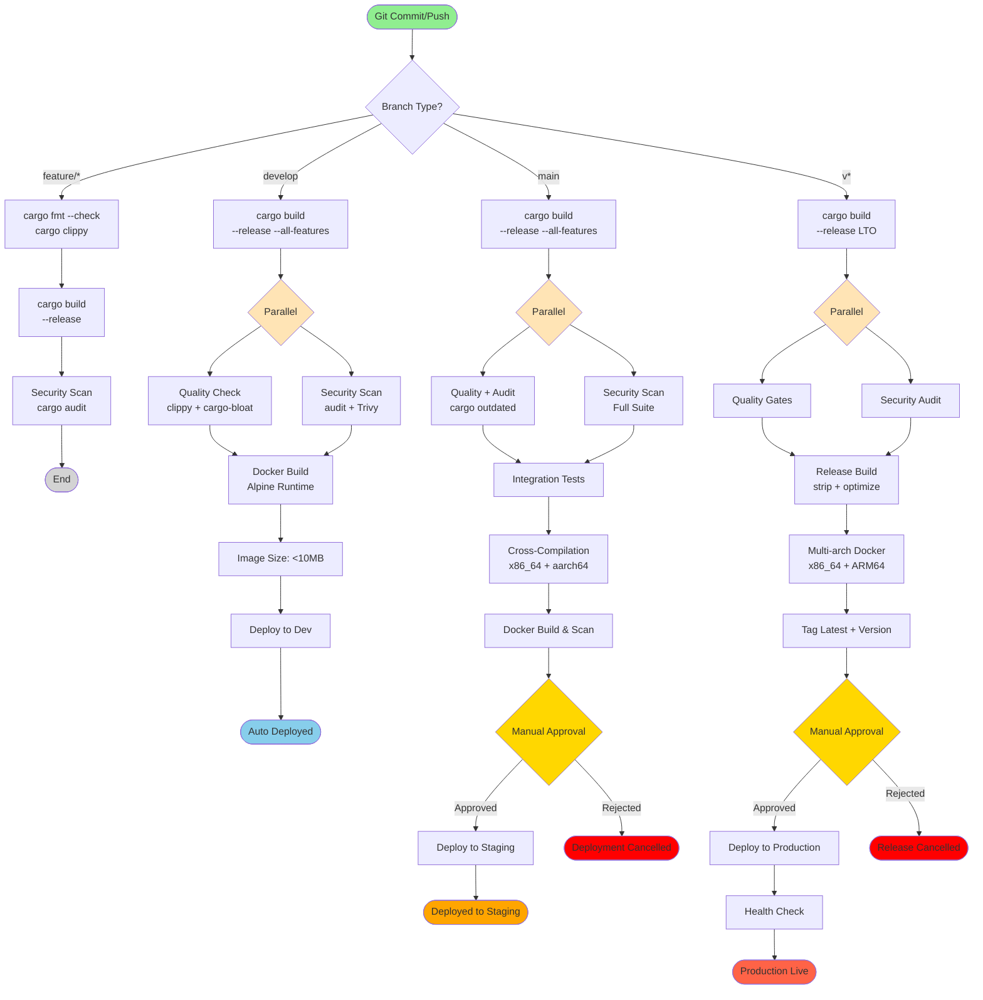

# Production-Ready Rust Pipeline

Battle-tested CI/CD pipeline for Rust projects, based on best practices from **Mozilla**, **Cloudflare**, and **Rust Foundation**.

## Key Features

✅ **Cargo Workspace** - Multi-crate project support
✅ **Clippy Linting** - Deny warnings in CI
✅ **Security Scanning** - cargo-audit, Trivy, secrets detection
✅ **Code Coverage** - tarpaulin/llvm-cov with 80% threshold
✅ **Cross-Compilation** - Linux, macOS, Windows (x86_64, ARM64)
✅ **Minimal Images** - Alpine-based Docker images (<10MB)
✅ **Kubernetes Deployment** - Helm charts with rollback

## Pipeline Flow Diagram



### Pipeline Stages Explained

| Stage | Description | Duration | Failure Impact |
|-------|-------------|----------|----------------|
| **Build & Test** | cargo build + test with coverage | ~3-5 min | ❌ Pipeline stops |
| **Quality Check** | clippy (deny warnings), cargo-bloat | ~2-3 min | ❌ Pipeline stops |
| **Security Scan** | cargo-audit, Trivy for dependencies | ~2-3 min | ⚠️ Warning (develop), ❌ Fail (main/tags) |
| **Integration Tests** | Integration test suite | ~5-8 min | ❌ Pipeline stops |
| **Cross-Compilation** | Build for x86_64 + aarch64 Linux | ~8-12 min | ❌ Pipeline stops |
| **Docker Build** | Multi-stage Alpine build (<10MB) | ~3-5 min | ❌ Pipeline stops |
| **Deploy to Dev** | Auto-deploy to development | ~2-3 min | ⚠️ Warning only |
| **Deploy to Staging** | Manual approval required | ~3-5 min | ❌ Rollback triggered |
| **Deploy to Production** | Manual approval with health checks | ~10-15 min | ❌ Auto rollback |

### Cargo Cache Benefits

- **First build**: ~10-15 minutes
- **With cache**: ~2-4 minutes (70% faster)
- **Incremental**: ~30-60 seconds

### Binary Size Optimization

- **Debug build**: ~50-100MB
- **Release build**: ~5-15MB
- **Release + strip**: ~2-8MB
- **Alpine container**: **<10MB total**

## Required Configuration

### 1. Cargo.toml

```toml
[package]
name = "my-app"
version = "0.1.0"
edition = "2021"
rust-version = "1.75"

[dependencies]
tokio = { version = "1.35", features = ["full"] }
serde = { version = "1.0", features = ["derive"] }
serde_json = "1.0"

[dev-dependencies]
criterion = "0.5"
mockall = "0.12"

[profile.release]
lto = true              # Link-time optimization
codegen-units = 1       # Slower compile, faster runtime
opt-level = 3           # Maximum optimization
strip = true            # Strip symbols

[profile.dev]
opt-level = 0
debug = true

# Benchmarks
[[bench]]
name = "my_benchmark"
harness = false
```

### 2. Cargo Workspace (Optional)

```toml
# Workspace Cargo.toml
[workspace]
members = [
    "my-app",
    "my-lib",
    "my-cli",
]

[workspace.package]
edition = "2021"
rust-version = "1.75"
authors = ["Your Name <you@example.com>"]
license = "MIT OR Apache-2.0"

[workspace.dependencies]
tokio = { version = "1.35", features = ["full"] }
serde = { version = "1.0", features = ["derive"] }
```

### 3. Dockerfile (Multi-Stage)

```dockerfile
# Build stage
FROM rust:1.75-slim AS builder

WORKDIR /app

# Install dependencies
RUN apt-get update && apt-get install -y \
    pkg-config \
    libssl-dev \
    && rm -rf /var/lib/apt/lists/*

# Copy manifests
COPY Cargo.toml Cargo.lock ./

# Create dummy main to cache dependencies
RUN mkdir src && \
    echo "fn main() {}" > src/main.rs && \
    cargo build --release && \
    rm -rf src

# Copy source code
COPY src ./src

# Build for release
RUN cargo build --release

# Runtime stage - Alpine for minimal size
FROM alpine:3.19

# Install runtime dependencies
RUN apk add --no-cache ca-certificates libgcc

WORKDIR /app

# Create non-root user
RUN addgroup -g 1001 -S appuser && \
    adduser -u 1001 -S appuser -G appuser

# Copy binary from builder
COPY --from=builder /app/target/release/my-app /app/my-app

# Switch to non-root user
USER appuser

EXPOSE 8080

ENTRYPOINT ["/app/my-app"]
```

### 4. rustfmt.toml

```toml
# Rust formatting configuration
max_width = 100
hard_tabs = false
tab_spaces = 4
newline_style = "Unix"
use_small_heuristics = "Default"
reorder_imports = true
reorder_modules = true
remove_nested_parens = true
edition = "2021"
```

### 5. clippy.toml

```toml
# Clippy configuration
warn-on-all-wildcard-imports = true
```

## Bitbucket Variables

Configure these in **Repository Settings → Pipelines → Repository Variables**:

```bash
# Docker Registry
DOCKER_REGISTRY=docker.io
DOCKER_REPOSITORY=myorg/myapp
DOCKER_USERNAME=your-username
DOCKER_PASSWORD=***         # Mark as secured

# Kubernetes
KUBECONFIG=***              # Base64 encoded, mark as secured

# Cargo Registry (for publishing crates)
CARGO_REGISTRY_TOKEN=***    # Mark as secured
```

## Testing Best Practices

### Unit Test Example

```rust
#[cfg(test)]
mod tests {
    use super::*;

    #[test]
    fn test_add() {
        assert_eq!(add(2, 2), 4);
    }

    #[test]
    #[should_panic(expected = "divide by zero")]
    fn test_divide_by_zero() {
        divide(10, 0);
    }
}
```

### Integration Test

Create `tests/integration_tests.rs`:

```rust
use my_app::api;

#[tokio::test]
async fn test_api_health_check() {
    let response = api::health_check().await;
    assert!(response.is_ok());
}
```

### Benchmark Example

Create `benches/my_benchmark.rs`:

```rust
use criterion::{black_box, criterion_group, criterion_main, Criterion};
use my_app::compute_heavy_function;

fn benchmark_compute(c: &mut Criterion) {
    c.bench_function("compute heavy function", |b| {
        b.iter(|| compute_heavy_function(black_box(1000)))
    });
}

criterion_group!(benches, benchmark_compute);
criterion_main!(benches);
```

Run benchmarks:

```bash
cargo bench
```

## Performance Optimization

### Link-Time Optimization (LTO)

```toml
[profile.release]
lto = "fat"              # Full LTO for maximum optimization
codegen-units = 1        # Single codegen unit
```

### Profile-Guided Optimization (PGO)

```bash
# Step 1: Build with instrumentation
RUSTFLAGS="-Cprofile-generate=/tmp/pgo-data" cargo build --release

# Step 2: Run workload
./target/release/my-app

# Step 3: Build with profile data
RUSTFLAGS="-Cprofile-use=/tmp/pgo-data/merged.profdata" cargo build --release
```

### Cargo Cache

```bash
# Install cargo-cache
cargo install cargo-cache

# Clean old cache
cargo cache --autoclean
```

## Cross-Compilation

### Using `cross`

```bash
# Install cross
cargo install cross

# Build for Linux musl (static binary)
cross build --release --target x86_64-unknown-linux-musl

# Build for ARM64
cross build --release --target aarch64-unknown-linux-gnu

# Build for Windows
cross build --release --target x86_64-pc-windows-gnu

# Build for macOS
cross build --release --target x86_64-apple-darwin
```

### Common Targets

```bash
# Linux
x86_64-unknown-linux-gnu      # glibc
x86_64-unknown-linux-musl     # musl (static)
aarch64-unknown-linux-gnu     # ARM64

# Windows
x86_64-pc-windows-msvc        # MSVC
x86_64-pc-windows-gnu         # MinGW

# macOS
x86_64-apple-darwin           # Intel
aarch64-apple-darwin          # Apple Silicon
```

## Security Best Practices

### Dependency Auditing

```bash
# Install cargo-audit
cargo install cargo-audit

# Run security audit
cargo audit

# Fix vulnerabilities
cargo audit fix
```

### Deny Configuration

Create `.cargo/deny.toml`:

```toml
[advisories]
vulnerability = "deny"
unmaintained = "warn"
unsound = "warn"
yanked = "warn"

[licenses]
unlicensed = "deny"
allow = [
    "MIT",
    "Apache-2.0",
    "BSD-3-Clause",
]

[bans]
multiple-versions = "warn"
wildcards = "warn"
```

Run deny checks:

```bash
cargo install cargo-deny
cargo deny check
```

## Common Issues

### Build Failing?

1. **Update Rust toolchain**:
   ```bash
   rustup update stable
   ```

2. **Clear build cache**:
   ```bash
   cargo clean
   cargo build --release
   ```

3. **Check rust-version in Cargo.toml**:
   ```toml
   rust-version = "1.75"
   ```

### Tests Failing?

1. **Run with verbose output**:
   ```bash
   cargo test -- --nocapture --test-threads=1
   ```

2. **Run specific test**:
   ```bash
   cargo test test_name -- --exact
   ```

3. **Show ignored tests**:
   ```bash
   cargo test -- --ignored
   ```

### Binary Too Large?

1. **Enable LTO and stripping**:
   ```toml
   [profile.release]
   lto = true
   strip = true
   ```

2. **Analyze binary size**:
   ```bash
   cargo install cargo-bloat
   cargo bloat --release
   ```

3. **Use UPX compression**:
   ```bash
   upx --best --lzma target/release/my-app
   ```

## Code Coverage

### Using cargo-tarpaulin

```bash
# Install tarpaulin
cargo install cargo-tarpaulin

# Generate coverage
cargo tarpaulin --out Html --output-dir ./coverage

# With threshold
cargo tarpaulin --out Html --fail-under 80
```

### Using llvm-cov (Rust 1.60+)

```bash
# Install llvm-tools
rustup component add llvm-tools-preview
cargo install cargo-llvm-cov

# Generate coverage
cargo llvm-cov --html

# With threshold
cargo llvm-cov --fail-under-lines 80
```

## Custom Pipelines

### Benchmark

```bash
# Trigger from Bitbucket UI: Pipelines → Run pipeline → benchmark
# Runs Criterion benchmarks
```

### Publish Crate

```bash
# Trigger from Bitbucket UI: Pipelines → Run pipeline → publish-crate
# Publishes to crates.io
```

## References

- [The Rust Performance Book](https://nnethercote.github.io/perf-book/)
- [Mozilla Rust CI/CD](https://firefox-source-docs.mozilla.org/tools/try/index.html)
- [Cloudflare Workers Rust](https://developers.cloudflare.com/workers/languages/rust/)
- [Cargo Book](https://doc.rust-lang.org/cargo/)

---

**Based on patterns from Mozilla, Cloudflare, and Rust Foundation** 🚀
